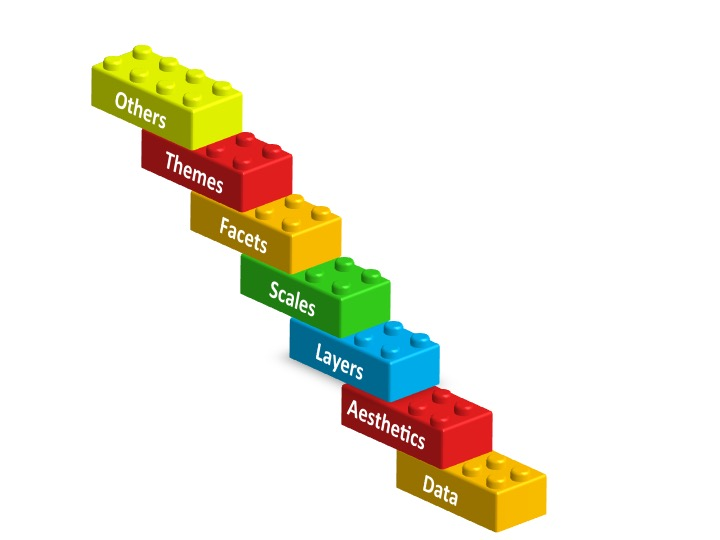
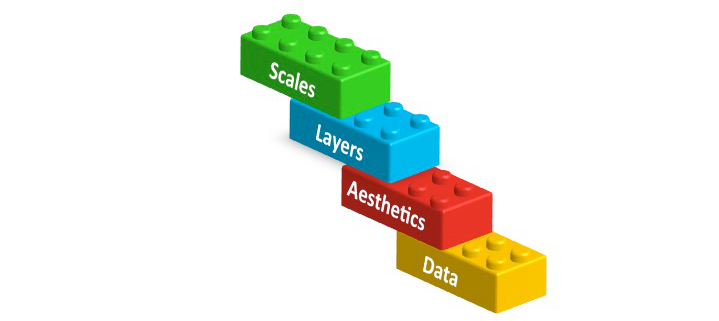

# Building a Plot {#building}
Vizualising data is extremely important both in terms of data checking and understanding, but also as a very powerful way of describing your data/results to your audience (in a presentation, your thesis, in a paper etc).

One of the really exciting things about R is the amazing graphics that you can produce that are very quickly journal ready. They are infinitely superior to Excel, SAS, Stata, or Minitab. However there is a small hurdle to get over with R but this is made easier by learning the grammar of graphics and using the package ggplot2 in R. 

NB: There are simpler ways to plot things with R, but are much uglier so this is worth the pain!

## Import dataset
So first of all you need to install the package and then run the library function to then run it in the current environment and start using its functions.

```{r}
#install.packages("ggplot2")
library(ggplot2)
```

Lets import a dataset and see what we can do with it in ggplot. The "NBA.csv" dataset (http://www.stat.ufl.edu/~winner/datasets.html) contains the height, weight, age of NBA players and their positions.  As we have done already have a look at the data frame and check how large it is and summarise it.

```{r}
nba <- read.csv("data/NBA.csv")
```


## An example of a plot by ggplot
Now lets visualize the relationship between the Weight and Height of NBA players according to their position.

```{r, echo=FALSE}
ggplot(nba, aes(x = Weight, y = Height, colour = Pos)) +
geom_point() +
stat_smooth(method = "lm", se = FALSE) +
scale_colour_brewer(palette="Dark2", 
                    name  ="Player \nPosition",
                    breaks=c("C", "F", "G"),
                    labels=c("Centre", "Forward", "Guard")) +
facet_grid(. ~ Pos) +
ggtitle("Scatterplot of weight and height of \n NBA players by position") +
xlab("Weight (kg)") +
ylab("Height (cm)") +
theme(axis.title = element_text(colour = "black", size = 14, face = "bold.italic"),
strip.text = element_text(colour = "black", face = "bold.italic", size = 12),
plot.title = element_text(colour = "black", size = 14, face = "bold.italic", hjust = 0.5),
legend.title = element_text(colour="black", size=14, face="bold"),
legend.text = element_text(colour="black", size = 14, face = "bold") )
```

The code for this plot is the following!! 

```{r, echo=TRUE, eval=FALSE}
ggplot(nba, aes(x = Weight, y = Height, colour = Pos)) +
geom_point() +
stat_smooth(method = "lm", se = FALSE) +
scale_colour_brewer(palette="Dark2", 
                    name  ="Player \nPosition",
                    breaks=c("C", "F", "G"),
                    labels=c("Center", "Forward", "Guard")) +
facet_grid(. ~ Pos) +
ggtitle("Scatterplot of weight and height of \n nba players by position") +
xlab("Weight (kg)") +
ylab("Height (cm)") +
theme(axis.title = element_text(colour = "black", size = 14, face = "bold.italic"),
strip.text = element_text(colour = "black", face = "bold.italic", size = 12),
plot.title = element_text(colour = "black", size = 14, face = "bold.italic", hjust = 0.5),
legend.title = element_text(colour="black", size=14, face="bold"),
legend.text = element_text(colour="black", size = 14, face = "bold") )
```


## The ggplot grammar

It might look a bit scary, but we will now explain how to build a ggplot step by step by understanding the ggplot grammar. Basically, ggplots are composed of building blocks that are added to the plot one after the other using the *+* sign. The diagram below shows the most important building blocks. We start building a plot from the bottom!

```{r, out.width = "450px", echo=FALSE, fig.align='center'}

```


## 1. DATA
```{r, out.width = "300px", echo=FALSE, fig.align='center'}

```

Anything you try to plot with ggplot needs to belong to a dataframe. The variables we want to visualize belong to the *NBA* dataset.

```{r}
head(nba)
```


## 2. Aesthetics mapping
```{r, out.width = "300px", echo=FALSE, fig.align='center'}

```

Aesthetics refer to the variables we want to see. In this case weight and height! So let's start building our plot using the *ggplot* function.

```{r, out.width = "250px", fig.align='center'}
ggplot(data = nba, aes(x = Weight, y = Height))
```


## 3. Layers
```{r, out.width = "300px", echo=FALSE, fig.align='center'}
knitr::include_graphics("lego_figs/ggplot_bricks_3.jpg")
```

In order to see something on our plot we need to add layers. Layers include geometric elements (geoms) and statistical transformations (stats). Since we want to build a scatterplot our first layer will be a layer of points (geom_point):

```{r, out.width = "200px", fig.align='center'}
ggplot(data = nba, aes(x = Weight, y = Height)) + 
  geom_point() # Layer 1
```

We also want to see the statistical relationship between weight and height so we will add a regression line as our second layer.

```{r, out.width = "200px", fig.align='center'}
ggplot(data = nba, aes(x = Weight, y = Height)) + 
  geom_point() + # Layer 1
stat_smooth(method = "lm", se = FALSE) # Layer 2
```


## 4. Scales
```{r, out.width = "300px", echo=FALSE, fig.align='center'}

```

As we said at the beginning we are also interested in the position of each player. As a first step we want to colour each point by the player's position. Scales map values in the data space to values in an aesthetic space. This can be colour, size or shape. This will also automatically create a legend to explain the colours on the plot. 

```{r, out.width = "250px", fig.align='center'}
ggplot(data = nba, aes(x = Weight, y = Height, colour = Pos)) + # added colour = POS
  geom_point() + 
stat_smooth(method = "lm", se = FALSE) + 
scale_colour_brewer(palette="Dark2") # scale maps aes data values (x and y) to aes colour 
```


NB: You can obtain a similar plot just by adding a colour variable in the aesthetics. Scales give you the ability to have control over the colours chosen.

```{r, out.width = "250px", fig.align='center'}
ggplot(data = nba, aes(x = Weight, y = Height, colour = Pos)) + 
  geom_point() + 
stat_smooth(method = "lm", se = FALSE) 
```


## 5. Facets
```{r, out.width = "300px", echo=FALSE, fig.align='center'}
knitr::include_graphics("lego_figs/ggplot_bricks_5.jpg")
```

If you remember the original plot, we actually wanted to see a separate plot for each player position. Using facets we can display our data split by the chosen variable, in this case position. 

```{r, out.width = "250px", fig.align='center'}
ggplot(data = nba, aes(x = Weight, y = Height, colour = Pos)) + 
  geom_point() + 
stat_smooth(method = "lm", se = FALSE) + 
scale_colour_brewer(palette="Dark2") + 
facet_grid(. ~ Pos) # split grid by the variable Pos
```

## 6+7. Themes and other useful tricks!
```{r, out.width = "300px", echo=FALSE, fig.align='center'}

```

ggplot is very flexible and you can adjust pretty much every aspect of the plot to your preference. In our original plot we had added a plot title using **ggtitle**, changed the x and y axis labels by **xlab** and **ylab** as shown in the code below.  

We also changed the title and labels of our legend by adding information to **scale** and the facet labels by adding information to **facet**.

Lastly, we used *theme* to change font size, colour and style of many elements of the plot. You can use theme to change pretty much everything you like on your plot. 

Here is the whole code again, with some useful websites to understand each building block better!

```{r, out.width = "450px", fig.align='center'}
ggplot(nba, aes(x = Weight, y = Height, colour = Pos)) +
# Visit http://docs.ggplot2.org/current/ for lists of geoms, stats etc  
geom_point() +
stat_smooth(method = "lm", se = FALSE) +
# Visit http://docs.ggplot2.org/current/scale_brewer.html for more colour options
scale_colour_brewer(palette="Dark2", 
                    name  ="Player \nPosition",
                    breaks=c("C", "F", "G"),
                    labels=c("Centre", "Forward", "Guard")) +
facet_grid(. ~ Pos, labeller=labeller(Pos = c("C"="Centre", "F"="Forward", "G"="Guard"))) +
ggtitle("Scatterplot of weight and height of \n NBA players by position") +
xlab("Weight (kg)") +
ylab("Height (cm)") +
# Visit http://docs.ggplot2.org/current/theme.html and http://www.sthda.com/english/wiki
#/ggplot2-themes-and-background-colors-the-3-elements for info about themes 
theme(axis.title = element_text(colour = "black", size = 14, face = "bold.italic"),
strip.text = element_text(colour = "black", face = "bold.italic", size = 12),
plot.title = element_text(colour = "black", size = 14, face = "bold.italic", hjust = 0.5),
#legend.position = "none", # can add this line to remove legend from plot
legend.title = element_text(colour="black", size=14, face="bold"),
legend.text = element_text(colour="black", size = 14, face = "bold") )
```


## Other plot types
So far we have seen how to draw a scatter plot with ggplot. You can plot pretty much any type of plot you like and you can change that by changing the *geom* type used. There are a number of geoms and you can see these when you use Rstudio as you type. But some of the common ones are below and also in the cheat sheet provided.

|**geom**|description|
|--------|-----------|
|**geom_point**| Points, eg. a scatterplot|
|**geom_line**| lines|
|**geom_ribbon**| Ribbons, y range with continuous x|
|**geom_polygon**| Polygon, a filled path|
|**geom_pointrange**| vertical line with point in the middle|
|**geom_path**| connect observations in original order|
|**geom_histogram**| Histograms|
|**geom_text**| Textural annotations|
|**geom_violin**| Violin plots|
|**geom_map**| Polygons from map|


\newpage 

## Histograms

```{r, out.width = "350px", fig.align='center'}
p <- ggplot(data=nba, aes(x=Age)) +
      geom_histogram( fill="blue", colour="purple") + 
      labs(title="Histogram of the Age of NBA players", x="Age (years)") +
      theme_bw()
p
```

\newpage

## Boxplots

```{r, out.width = "350px", fig.align='center'}
ggplot(data=nba) +
      geom_boxplot(aes(y=Height, x=Pos), fill="lightgrey", colour="purple") +
      labs(title="Boxplot of Height per Position", y="Height (cm)", x="Position") + 
# Set title and axis labels
      theme_bw()
```

\newpage 

One of the things about box plots though is that you loose a lot of information so you can get fancy and overlay the raw dots like this...

```{r, out.width = "350px", fig.align='center'}
ggplot(data=nba) +
geom_boxplot(aes(y=Height, x=Pos), fill="lightgrey", colour="purple") +
geom_jitter(aes(y=Height, x=Pos), colour="blue", size=0.2) + # geom_jitter spreads points 
#out so that they don't overlap
labs(title="Boxplot of Height per Position", y="horse power", x="Number of cylinders") + 
theme_bw()

```

\newpage

## Barcharts

```{r, out.width = "350px", fig.align='center'}
ggplot(data=nba, aes(x=Pos, fill=Age21)) + 
    geom_bar(colour="black", stat="count",
             position=position_dodge(), # split bars by Age21 variable. 
                                        #try commenting this line out 
             size=.3) +                        # Thinner lines
    scale_fill_discrete(name="Age of player") +      # Set legend title
    xlab("Player Position") + ylab("Number of players") + # Set axis labels
    ggtitle("Barchart of player position by Age category") +     # Set title
    theme_bw() # Set theme
```

<!--Just to give you some examples of the sorts of things you can do with R...

You can pull in output from various models and over lay results to build up very complex figures such as this.


Here we have actually displayed all the data from individual animals adding colours for disease status and then over laid a model result which would be almost impossible in another software environment...


Also you can do all your spatial stats and mapping without having to export data and save lots of files and then import into a new tool...

--->

\newpage

## More info
* R Cookbook Graphs \newline
http://www.cookbook-r.com/Graphs/

* Line plots tutorial \newline
http://t-redactyl.io/blog/2015/12/creating-plots-in-r-using-ggplot2-part-1-line-plots.html

* Bar plots tutorials \newline
http://t-redactyl.io/blog/2016/01/creating-plots-in-r-using-ggplot2-part-3-bar-plots.html  \newline
http://t-redactyl.io/blog/2016/01/creating-plots-in-r-using-ggplot2-part-4-stacked-bar-plots.html

* Scatter plots tutorials \newline
http://t-redactyl.io/blog/2016/02/creating-plots-in-r-using-ggplot2-part-5-scatterplots.html  \newline
http://t-redactyl.io/blog/2016/02/creating-plots-in-r-using-ggplot2-part-6-weighted-scatterplots.html

* Histograms tutorial \newline
http://t-redactyl.io/blog/2016/02/creating-plots-in-r-using-ggplot2-part-7-histograms.html

* Boxplots tutorial \newline
http://t-redactyl.io/blog/2016/04/creating-plots-in-r-using-ggplot2-part-10-boxplots.html

\newpage

##Exercises
###Ex1. 
Using dataset *mtcars* plot a box-plot of Gross horse power (*hp*) against number of cylinders (*cyl*). Give the plot the title *Boxplot by (Your Name)*. Add the real horse power values using dots coloured by Number of carburetors (*carb*) faceted by Number of forward gears (*gear*). Change the labels of gear to "3 Gears", "4 Gears", "5 Gears".

Hint: To find more info about an R dataset try *?mtcars*.

##Ex2. 
Using the same dataset plot a stacked bar chart of number of cylinders (*cyl*) by Transmission (*am*). Change colours corresponding to *am* manually to blue for 0 and red for 1. Change the legend labels to Autumatic and Manual and the legend title to Transmission.

Hint: Check the bar plots tutorial websites above for help

